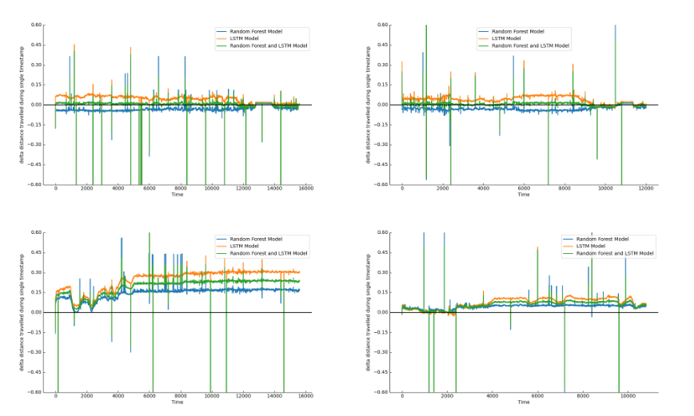

# GNSS 欺骗检测

主要的GNSS：GPS（全球性）、北斗（中国）、GLONASS（俄罗斯）、Galileo（欧盟）

## 数据集——comma2k19

- 包含来自u-blox和Qcom的实时和原始导航卫星系统数据

  > - u-blox：一家瑞士公司，专注于提供全球定位系统（GPS）和无线通信技术解决方案。
  > - Qcom：高通，一家美国的半导体和通信技术公司。产品和技术被广泛应用于物联网、汽车技术领域

- 数据构成：

  - 维度
  - 经度
  - 速度
  - utc时间戳
  - 高度
  - 方位角数据

- 数据处理：

  - 插值处理：在GNSS的两个最近观测值之间对CAN和IMU（惯性测量单元，用于测量和跟踪物体的加速度、角速度和方向）进行插值
  - 去除数据重复值
  - 将GNSS IMU CAN的不同数据合并

- 选择输入特征：

  - GNSS的维度、经度
  - CAN的速度
  - 转向角度数据
  - IMU的前进加速度

- 预测值——下一时刻与当前时刻的距离

  - 若距离误差超过阈值，则遭遇GNSS欺骗攻击

## 随机森林模型

- 数据集的随机采样：有放回抽样，得到多个不同的训练子集

- 特征的随机选择：对每个训练子集，随机选择一部分特征作为决策树的候选特征

- 构建决策树：

  - 使用选定的 特征 和 训练子集 来构造 多个决策树模型
  - 采用递归分割，根据特征的值进行划分，使得同一类别的样本最多

- 整合预测结果：

  - 本实验是回归问题——平均多个决策树的预测值，得到最终结果

  - > 分类问题——通过投票的方式，选择多数决策树预测的类别作为最终结果

##### 优点

- 减少了过拟合的风险

## LSTM模型（长短期记忆网络）

- 一种循环神经网络（RNN）的变体，用于处理序列数据
- 引入门控机制和记忆单元，克服传统RNN中的梯度消失和梯度爆炸
- 组成部分：
  - 记忆单元
    - 负责存储和更新信息；
    - 通过一个内部状态保持信息流动，并在每个时间步长中更新状态
  - 输入门
    - 根据当前输入和先前的状态 计算一个介于0和1之间的值
    - 决定是都将当前输入信息添加到记忆单元中
  - 遗忘门
    - 根据当前输入和先前的状态 计算一个介于0和1之间的值
    - 决定是否从记忆单元中删除某些信息
  - 输出门
    - 根据当前输入和先前的状态 计算一个介于0和1之间的值
    - 决定是否从记忆单元中输出信息
- 优化模型参数的方法：反向传播算法和梯度下降
- 可以根据给定的状态序列预测下一个状态

## 模型组合

- 将随机森林和LSTM进行线性加权组合：
  - $Y=w_1 * X_1+(1-w_1)*X_2+\lambda/2n * \sum ^n _{i=0}w^2$
  - 此处将权重w1初始化为0.5，训练步长初始化为0.05
  - $\lambda$为损失因子，n为输入数据集的总数

##### 评估性能指标——RMSE均方根误差

MSE：计算每个样本预测值与真实值的 差值的平方--> 求平均数（ ÷ 样本总数）

RMSE：对MSE开根号

- 对异常值敏感，如果数据中存在离群点或异常值，平方操作会放大异常值的影响

## 实验结果

##### 模型RMSE均值对比

| RF     | LSTM   | 模型组合 |
| ------ | ------ | -------- |
| 0.1922 | 0.1958 | 0.178    |

##### 损失函数——MAE平均绝对误差

将单模型与组合模型在相同的测试集上进行测试并绘制图像，用 真实距离和 预测距离之间的差值来衡量预测准确性

